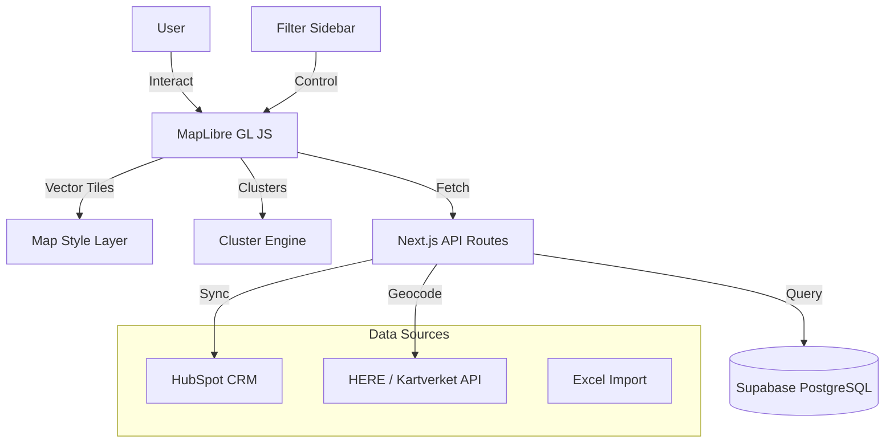

# Volterra Asset Map

> Large-scale geospatial visualization of 42,500+ EV charging stations with real-time filtering, clustering, and CRM integration.


## Architecture



## Key Features

- **42,500+ assets** — Interactive map rendering tens of thousands of charging stations across Nordic countries
- **Dynamic clustering** — MapLibre GL JS cluster engine for performant rendering at all zoom levels
- **Advanced filtering** — Multi-criteria sidebar with network, status, connector type, and power filters
- **CRM sync** — Bidirectional HubSpot integration for facility data and deal tracking
- **Geocoding** — Dual geocoding with HERE API and Kartverket (Norwegian national mapping authority)
- **Responsive overlay** — Slide-out sidebar pattern for asset detail views on all screen sizes
- **Dark/light mode** — Theme-aware map styling with next-themes

## Tech Stack

| Layer     | Technology                              |
| --------- | --------------------------------------- |
| Framework | Next.js 16 (App Router)                 |
| UI        | React 19, Tailwind CSS, Radix UI        |
| Map       | MapLibre GL JS with custom layers       |
| Animation | Framer Motion                           |
| Database  | PostgreSQL (Supabase) with spatial data |
| CRM       | HubSpot API (facility sync)             |
| Geocoding | HERE API, Kartverket                    |

## Project Structure

```
src/
├── app/
│   ├── api/facilities/     # Facility data API route
│   ├── auth/               # Authentication (login, callback)
│   ├── layout.tsx          # Root layout
│   └── page.tsx            # Map page
├── components/
│   ├── asset-map/          # MapLibre wrapper, layers, controls
│   ├── auth/               # Authentication components
│   └── ui/                 # shadcn/ui components (Radix-based)
├── lib/
│   ├── hooks/              # Custom React hooks
│   ├── supabase/           # Database clients
│   └── utils/              # Geocoding, formatting
├── middleware.ts            # Auth middleware
scripts/                     # Data import & utility scripts
supabase/                    # Database migrations
```

## Getting Started

1. Install dependencies:

   ```bash
   npm install
   ```

2. Configure environment:

   ```bash
   cp .env.example .env.local
   ```

3. Required environment variables:

   ```env
   NEXT_PUBLIC_SUPABASE_URL=https://your-project.supabase.co
   NEXT_PUBLIC_SUPABASE_ANON_KEY=your_anon_key
   SUPABASE_SERVICE_ROLE_KEY=your_service_role_key
   ```

4. Start development server:

   ```bash
   npm run dev
   ```

## Key Design Decisions

- **MapLibre over Mapbox** — Open-source, no token limits, full control over tile sources
- **Client-side clustering** — MapLibre's built-in cluster engine handles 42K+ points without server-side processing
- **Sidebar overlay pattern** — Keeps map context visible while showing asset details
- **Supabase for spatial data** — PostgreSQL with PostGIS-compatible queries, no separate geo database needed
- **Dual geocoding** — HERE API for international coverage, Kartverket for Norwegian address precision

## Built By

Adrian Marten — [GitHub](https://github.com/adrianmarten)
