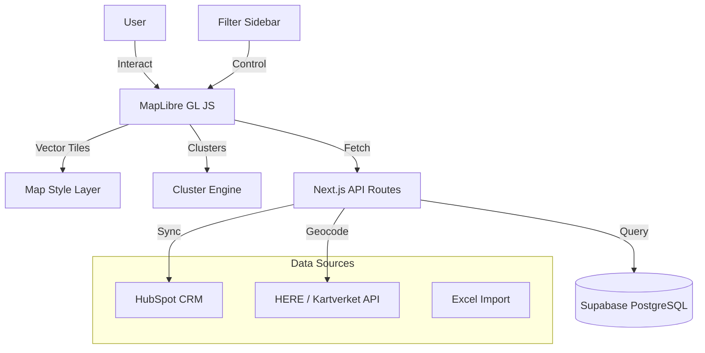

# Volterra Asset Map

> Sales and operations had no unified spatial view of 42,500+ charging stations across Nordic countries -- asset data lived in spreadsheets, CRM fields, and third-party databases. This map unified everything into one interactive tool.


## The Problem

Asset data was fragmented across Excel spreadsheets, HubSpot CRM records, and third-party station databases. Sales reps couldn't answer basic coverage questions ("how many stations do we have in Bergen?") without manual data gathering. Operations had no way to visualize network density, identify coverage gaps, or plan expansion -- every analysis started from scratch.

## What This Does

- **42,500+ stations on one interactive map** -- MapLibre GL JS renders all Nordic charging stations with client-side clustering that stays performant at every zoom level
- **Multi-criteria filtering** -- Sidebar filters by network, status, connector type, and power level so sales can answer coverage questions in seconds
- **Bidirectional CRM sync** -- HubSpot facility data flows in and out, keeping the map and CRM in sync without manual exports

## Impact

| Metric                | Detail                                                                     |
| --------------------- | -------------------------------------------------------------------------- |
| Stations mapped       | 42,500+ across Nordic countries                                            |
| Rendering performance | Client-side clustering handles full dataset without server-side processing |
| Data sources unified  | Excel, HubSpot CRM, third-party databases into one view                    |
| Coverage queries      | Answered in seconds via interactive filtering (previously manual)          |

## Part of the Volterra Platform

Asset Map shares its Supabase data layer with the [Knowledge Engine](../volterra-knowledge-engine/), making facility data searchable across the platform. CRM records are shared bidirectionally with [Call Intelligence](../volterra-call-intelligence/) for deal context.

## Architecture


```mermaid
graph TB
    User[User] -->|Interact| Map[MapLibre GL JS]
    Map -->|Vector Tiles| Style[Map Style Layer]
    Map -->|Clusters| Cluster[Cluster Engine]

    API[Next.js API Routes] -->|Query| DB[(Supabase PostgreSQL)]
    API -->|Sync| CRM[HubSpot CRM]
    API -->|Geocode| GEO[HERE / Kartverket API]

    Map -->|Fetch| API
    Sidebar[Filter Sidebar] -->|Control| Map

    subgraph Data Sources
        XLSX[Excel Import]
        CRM
        GEO
    end
```

## Key Features

- **42,500+ assets** — Interactive map rendering tens of thousands of charging stations across Nordic countries
- **Dynamic clustering** — MapLibre GL JS cluster engine for performant rendering at all zoom levels
- **Advanced filtering** — Multi-criteria sidebar with network, status, connector type, and power filters
- **CRM sync** — Bidirectional HubSpot integration for facility data and deal tracking
- **Geocoding** — Dual geocoding with HERE API and Kartverket (Norwegian national mapping authority)
- **Responsive overlay** — Slide-out sidebar pattern for asset detail views on all screen sizes
- **Dark/light mode** — Theme-aware map styling with next-themes

## Tech Stack

| Layer     | Technology                              |
| --------- | --------------------------------------- |
| Framework | Next.js 16 (App Router)                 |
| UI        | React 19, Tailwind CSS, Radix UI        |
| Map       | MapLibre GL JS with custom layers       |
| Animation | Framer Motion                           |
| Database  | PostgreSQL (Supabase) with spatial data |
| CRM       | HubSpot API (facility sync)             |
| Geocoding | HERE API, Kartverket                    |

## Project Structure

```
src/
├── app/
│   ├── api/facilities/     # Facility data API route
│   ├── auth/               # Authentication (login, callback)
│   ├── layout.tsx          # Root layout
│   └── page.tsx            # Map page
├── components/
│   ├── asset-map/          # MapLibre wrapper, layers, controls
│   ├── auth/               # Authentication components
│   └── ui/                 # shadcn/ui components (Radix-based)
├── lib/
│   ├── hooks/              # Custom React hooks
│   ├── supabase/           # Database clients
│   └── utils/              # Geocoding, formatting
├── middleware.ts            # Auth middleware
scripts/                     # Data import & utility scripts
supabase/                    # Database migrations
```

## Getting Started

1. Install dependencies:

   ```bash
   npm install
   ```

2. Configure environment:

   ```bash
   cp .env.example .env.local
   ```

3. Required environment variables:

   ```env
   NEXT_PUBLIC_SUPABASE_URL=https://your-project.supabase.co
   NEXT_PUBLIC_SUPABASE_ANON_KEY=your_anon_key
   SUPABASE_SERVICE_ROLE_KEY=your_service_role_key
   ```

4. Start development server:

   ```bash
   npm run dev
   ```

## Key Design Decisions

- **MapLibre over Mapbox** — Open-source, no token limits, full control over tile sources
- **Client-side clustering** — MapLibre's built-in cluster engine handles 42K+ points without server-side processing
- **Sidebar overlay pattern** — Keeps map context visible while showing asset details
- **Supabase for spatial data** — PostgreSQL with PostGIS-compatible queries, no separate geo database needed
- **Dual geocoding** — HERE API for international coverage, Kartverket for Norwegian address precision

## Built By

Adrian Marten — [GitHub](https://github.com/adrianmarten)
